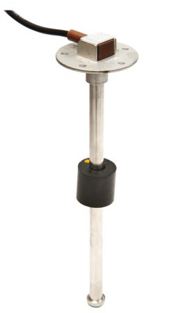
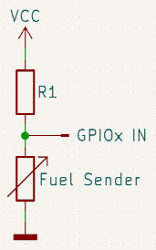
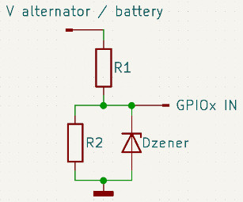

# ESP32 Engine, Battery & Fuel Meter

## General
This project shows an example design for an ESP32-based adapter with which a number of Engine, Battery and Fuel related properties can be read, interpreted an communicated with a Signal K host. This design has actually been built and is in use on on my own sailboat.

## Features
- Fuel Level as a ratio (percentage) and volume;
- Alternator Voltage;
- Engine Status (stopped/running);
- Engine Running Time (persistent over Power Cycles);
- Battery Voltage for two Batteries;
- WiFi connection to the Boat Network;
- Calibration possibilities;
- Using the ESP32 platform.

## Fuel Level
The value (resistance) of a Fuel or Water Level Sender is indicative for the (remaining) amount of Liquid in the Tank. In this example, a Wema Fuel Level Sender is used which has the VDO type values: 0 Ohm when empty and 190 Ohm when full. Any other type of Linear Sender will do as long as you calibrate it properly.

The Sender is connected between an Analog Port and ground with a pull-up resistor connected to 3.3V. The actual value of the Sender determines the voltage applied to the Analog Port which in turn is an indication of the Fluid Level in the Tank. See the [Resistor Calculations](documents/Resistor Calculations.ods) document for example resistor values.

The determined Input Voltage is then calculated into the ratio, a value between 0.0 and 1.0 which can be used to present a percentage (Signal K offers a number of translations), and the volume. The latter is sent to Signal K in m3 but Signal K offers a number of translations for this value as well.

The values sent to Signal K are:
- type : the type of Tank;
- capacity : total capacity/volume of the Tank;
- currentLevel : the level of fluid in the Tank as a value 0.0-1.0 (Signal K documentation mentions 0-100% which is incorrect);
- currentVolume : the volume of fluid in the Tank.

## Alternator and Engine values
The Alternator is connected to a voltage divider to obtain a usable value at the analog port it is connected to. See the [Resistor Calculations](documents/Resistor Calculations.ods) document for example resistor values. The zener diode is a protection for the analog input.

The values sent to Signal K are:
- label : human readable label for the propulsion unit;
- alternatorVoltage : Alternator voltage;
- state : the current state of the Engine;
- runTime : total running time of the Engine (Engine Hours in seconds).

## Battery Voltage
This design provides the possibility to connect and monitor two Batteries.
For connection details, see "Alternator and Engine values" above.

The value sent to Signal K is:
- voltage : Voltage measured at or as close as possible to the device.