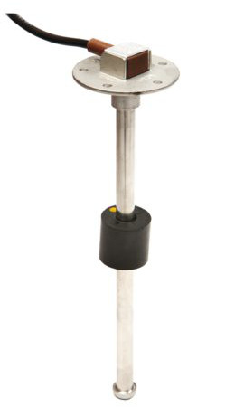
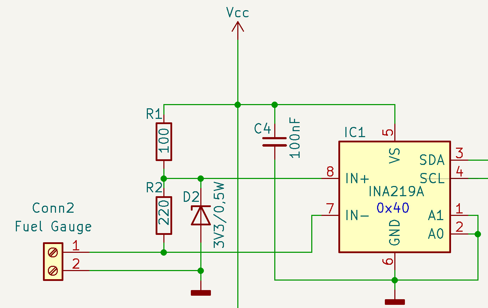
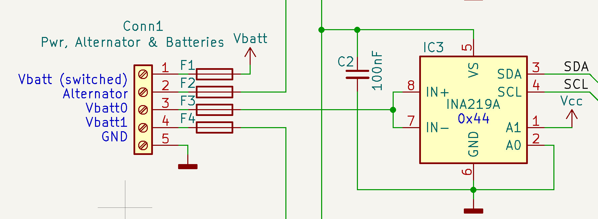

# ESP32 Engine, Battery & Fuel Meter

## General

This project shows an example design for an ESP32-based adapter with which a number of Engine, Battery and Fuel related properties can be read, interpreted an communicated with a Signal K host. This design has actually been built and is in use on on my own sailboat.

## Features

- Fuel Level as a ratio (percentage) and volume;

- Alternator Voltage;

- Engine Status (stopped/running);

- Engine Running Time (persistent over Power Cycles);

- Battery Voltage for two Batteries;

- WiFi connection to the Boat Network;

- Calibration possibilities;

- Using the ESP32 platform.

## Fuel Level

The value (resistance) of a Fuel or Water Level Sender is indicative for the (remaining) amount of Liquid in the Tank. In this example, a Wema Fuel Level Sender is used which has the VDO type values: 0 Ohm when empty and 190 Ohm when full. Any other type of Linear Sender will do as long as you calibrate it properly.

The Sender is connected in series with a 220 Ohm resistor over which the voltage drop is being measured. Due to the inaccuracy of a standard analog input of ESP32 types of processors, an INA219A is being used. A 3.3V zenerdiode keeps a steady voltage over the resistor-sender series connection. The actual value of the Sender determines the voltage drop over the 220 Ohm resistor which in turn is an indication of the Fluid Level in the Tank.

The determined Input Voltage is then calculated into the ratio, a value between 0.0 and 1.0 which can be used to present a percentage (Signal K offers a number of translations), and the volume. The latter is sent to Signal K in m3 but Signal K offers a number of translations for this value as well. Because I found the Wema sender I was using was not linear, there is an additional function with which one can calibrate the resulting values.

The values sent to Signal K are:

- type : the type of Tank;

- capacity : total capacity/volume of the Tank;

- currentLevel : the level of fluid in the Tank as a value 0.0-1.0 (Signal K documentation mentions 0-100% which is incorrect);

- currentVolume : the volume of fluid in the Tank.

## Alternator and Engine values

The Alternator is also connected to an INA219A voltage monitor to obtain an accurate voltage registration. The current sensing capabilities are not being used in this design.

When the measured voltage is above a certain threshold, the engine is considered as running and time is added to the total runtime and updated in flash memory.

The values sent to Signal K are:

- label : human readable label for the propulsion unit;

- alternatorVoltage : Alternator voltage;

- state : the current state of the Engine;

- runTime : total running time of the Engine (Engine Hours in seconds).

## Battery Voltage

This design provides the possibility to connect and monitor two Batteries. For connection details, see "Alternator and Engine values" above.

The value sent to Signal K is:

- voltage : Voltage measured at or as close as possible to the device.

